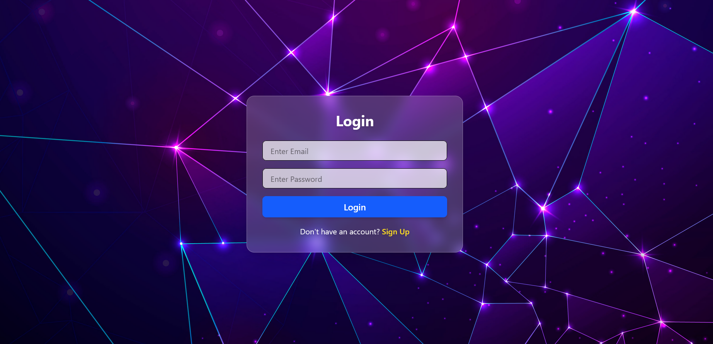

Role-Based Authentication Frontend (React.js + Context API + Tailwind CSS)
 # UI Screenshot

🚀 Project Features
🔐 Authentication

User Registration

Login / Logout

JWT Token Handling

Auto Redirect Based on Role

👑 Role Management

Admin Dashboard

Member Dashboard

Only Admin can:

View all users

Update user

Delete user

🛡 Protected Routing

Admin cannot access member pages

Member cannot access admin pages

Guest cannot access any dashboard

📁 Project Folder Structure
src/
│── api/
│   └── axiosInstance.js
│
│── context/
│   └── AuthContext.jsx
│
│── routes/
│   ├── AppRoutes.jsx
│   └── ProtectedRoutes.jsx
│
│── page/
│   ├── Auth/
│   │   ├── Login.jsx
│   │   └── SignUp.jsx
│   │
│   ├── Admin/
│   │   ├── AdminDashboard.jsx
│   │   ├── ManageUsers.jsx
│   │   └── UpdateUser.jsx
│   │
│   └── Member/
│       └── MemberDashboard.jsx
│
│── assets/
│   └── images/
│       └── bgImage.jpg
│
└── App.jsx

🧠 Workflow Explained
1️⃣ AuthContext.jsx — Manages Authentication State

What it stores:

token

role

loginUser()

logoutUser()

Workflow:

When user logs in → save token + role in localStorage

Provide authentication globally

Used to protect routes and dashboards

2️⃣ ProtectedRoutes.jsx — Protect Admin & Member Routes

Checks:

If token does NOT exist → redirect /login

If role is NOT allowed → redirect /login

If everything is correct → render component

✔ Admin cannot open member page
✔ Member cannot open admin page
✔ Guests cannot open any protected page

3️⃣ AppRoutes.jsx — Defines All Routes
/login
/signup
/admin-dashboard       (admin only)
/admin/manage-users    (admin only)
/admin/update-user/:id (admin only)
/member-dashboard      (member only)

Uses:

<ProtectedRoutes allowrole="admin">...</ProtectedRoutes>

4️⃣ axiosInstance.js — Preconfigured Axios

Base URL: http://localhost:4000/api/user

Automatically attaches JWT Token in headers

Used in Login, Signup, Manage Users, Update User

5️⃣ Login.jsx — Authenticates User

Workflow:

User enters email & password

Request: POST /login

Response returns:

token
role

Save token + role using loginUser()

Redirect based on role:

admin → /admin-dashboard

member → /member-dashboard

6️⃣ SignUp.jsx — Registers User

Workflow:

User enters name, email, password, role

POST /register

On success → redirect /login

UI: Glassmorphism + background image

7️⃣ AdminDashboard.jsx — Admin Panel

Admin can:
✔ View All Users
✔ Delete User
✔ Update User
✔ Navigate to ManageUsers.jsx

8️⃣ MemberDashboard.jsx — Member Panel

Simple dashboard for logged-in users.