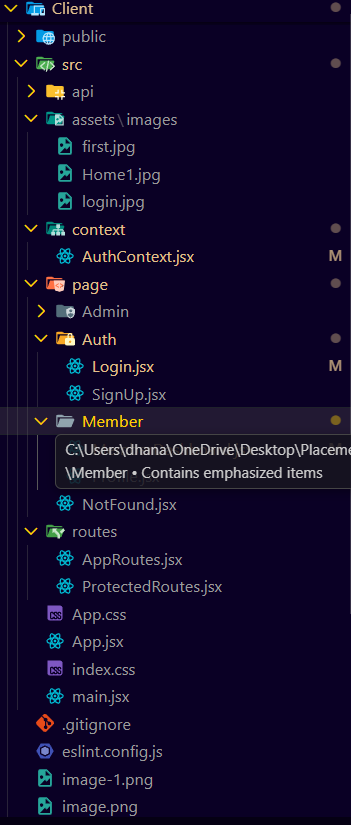
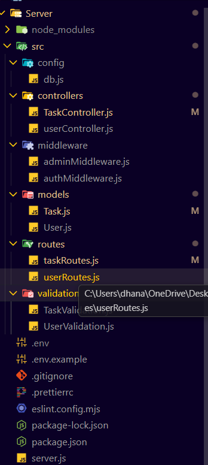

# 📝 Task Management System  
A full-stack role-based Task Management System where **Admin** manages users & tasks, and **Members** can view/update their assigned tasks.

This project includes:
- User Authentication (Register/Login)
- Role-based Authorization (Admin / Member)
- Admin Dashboard
- Member Dashboard
- Task Assignment & Management
- Complete CRUD operations for Users & Tasks

---
## Screenshots 


## 🔥 Features

### 🔐 Authentication
- User Registration
- Login with Email & Password
- JWT-based Authentication
- Role-based Authorization (Admin / Member)

---

## 👤 Member Features
After login, if user is **Member**, he will see:

### ✔ Member Dashboard
- View personal information  
- View all tasks assigned to him  
- Update task status  
- Cannot delete/update other users  
- Cannot create tasks  

---

## 👑 Admin Features
After login, if user is **Admin**, he will see:

### ✔ User Management
- View all users  
- Update user details  
- Delete any user  
- View user details along with assigned tasks  

### ✔ Task Management
- Create a new task  
- Assign task to any member  
- Update task details  
- Update task status  
- Delete tasks  
- View all tasks in the system  

---

## 🏗 Project Flow
User Register
↓
User Login (Role-Based Authentication)
↓
┌─────────────┐ ┌─────────────┐
│ Member │ │ Admin │
└─────────────┘ └─────────────┘
↓ ↓
Member Dashboard Admin Dashboard
↓ ↓
View Member Info Manage Users
View Assigned Tasks Create Task
Update Task Status Assign Task
Manage All Tasks
Update Task Status
Delete Task

---

## 🗂 Folder Structure (Backend)
## Frontend 

## Backend 


---

## 🛠 Tech Stack

### **Backend**
- Node.js
- Express.js
- MongoDB + Mongoose
- JWT Authentication
- Yup/ for Validation

### **Frontend** (optional)
- React.js
- Axios
- Context API / 
- Tailwind / CSS

---

## 📌 API Endpoints

### 🔐 Authentication
| Method | Endpoint       | Description |
|--------|----------------|-------------|
| POST   | `/api/register` | Register a new user |
| POST   | `/api/login`    | Login user |

---

### 👤 Member APIs
| Method | Endpoint                | Description |
|--------|-------------------------|-------------|
| GET    | `/api/tasks/my-tasks`    | Get logged-in member tasks |
| PUT  | `/api/tasks/:id/status` | Update task status (assigned to the member) |

---

### 👑 Admin APIs
| Method | Endpoint                  | Description |
|--------|---------------------------|-------------|
| GET    | `/api/users`               | Get all users |
| PUT    | `/api/users/:id`           | Update user |
| DELETE | `/api/users/:id`           | Delete user |
| POST   | `/api/tasks`               | Create task |
| GET    | `/api/tasks`               | Get all tasks |
| PUT  | `/api/tasks/assign/:id`    | Assign task to member |
| DELETE | `/api/tasks/:id`           | Delete task |

---

## 🚀 How to Run the Project Locally

### 1️⃣ Clone Repo
```bash
git clone https://github.com/DhananjayMallik/Task-Management-System.git
cd TaskManagementSystem
npm install
MONGO_URI=your_mongo_url
JWT_SECRET=your_jwt_secret
PORT
npm run dev for vite
npm start without vite
